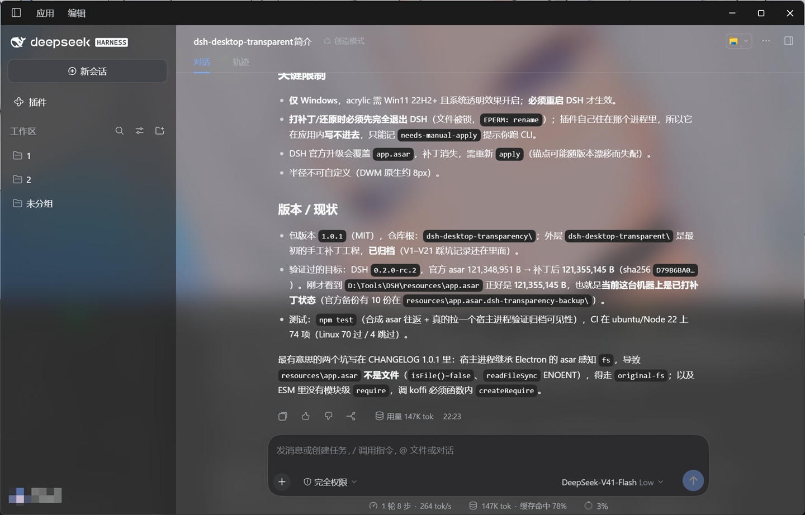

# dsh-desktop-transparency

让 **DSH Desktop 的窗口透明**——透出桌面壁纸，带 acrylic 毛玻璃与圆角。



仅 Windows。以 **DSH 插件（bundle）** 形式安装，也带一个可独立使用的 CLI。

## 安装

```powershell
# 推荐：应用内「插件」页安装本包，或
dsh plugin --profile desktop add dsh-desktop-transparency
```

装完**必须重启 DSH Desktop** 才生效。不装插件、只用 CLI 也行：`node lib/cli.mjs apply`。

## 先知道这四条

| | |
|---|---|
| **仅 Windows** | acrylic 需要 Windows 11 22H2+，且系统"透明效果"开着 |
| **必须重启** | 效果在窗口创建时注入，打完补丁要重启 DSH 才看得到 |
| **打补丁前先退出 DSH** | Windows 不允许替换运行中应用的 `app.asar`（`EPERM`），`apply`/`restore` 会**直接拒绝**并提示你关掉它 |
| **DSH 升级后要重新 apply** | 官方更新会覆盖 `app.asar`，补丁消失 |

## 常用命令

```powershell
dsh-desktop-transparency status    # 装了没：官方版 / 补丁版 / 未知版本
dsh-desktop-transparency apply     # 打补丁（先自动备份官方归档）
dsh-desktop-transparency restore   # 还原官方归档
dsh-desktop-transparency backups   # 备份列表（每个约 121 MB）
dsh-desktop-transparency boot      # 插件上次启动时的决定
```

DSH 安装目录自动探测（`--dsh-root DIR` 可指定）；状态目录在
`%LOCALAPPDATA%\dsh-desktop-transparency`，和 DSH 安装目录分开，升级 DSH 不会动它。

`boot` 是排查用的那份记录——插件跑在桌面宿主里，它的日志没人看得到，所以它把
"启动时决定做什么"写进 `last-boot.json`：`applied`（重打成功，等重启）/
`needs-manual-apply`（应用正锁着文件，按提示关掉后跑 CLI）/ `refused`（锚点失配，`reason` 点名是哪一处）。

## 它改了什么

只改随应用发布的 `resources\app.asar` 里的 **`lib/main.js` 一个文件**：

- **窗口**：`transparent: true`、`backgroundColor: "#00000000"`、保留 `backgroundMaterial: "acrylic"`、标题栏 overlay 强制透明。
- **页面**：画布 / 会话区 / 侧栏内容 / dock 标签宿主透明，侧栏保留 55%（深色）· 72%（浅色）可读底。
- **去掉遮挡**：侧栏会话列表底部那条"渐隐到纯黑"的黑条、dock 压暗层。
- **输入框背后不留东西**：消息区的滚动容器缩短到输入框顶边、composer 座位挪出滚动容器且**不画底色**
  ——正文永远画不到输入框背后，所以既不会"正文压在统计行上"，也不需要任何底板（透明窗口里
  `backdrop-filter` 是无效的，想"透明地糊掉"没有出路）。轨迹视图（官方自己给座位定位、台账自带留白）
  不在这两条规则的范围内。
- **圆角**：用包内自带的 FFI 调 `DwmSetWindowAttribute(DWMWA_WINDOW_CORNER_PREFERENCE = 2)`，圆角交给 DWM（抗锯齿、材质保留）。
- **毛玻璃的"奶度"只在一处**：`lib/glass-tuning.mjs`（窗口材质 + 每块面板的底色）。模板里写
  `${__dshGlass…}` 占位符，`lib/patch-rules.mjs` 在打补丁前渲染；拼错名字会**报错**而不是把字面量注进
  `main.js`。旧的手工工程（`../`，已归档）里同一组值在 `tools/spec-win-css.json` 顶部的 `params`，
  两边一致性用 `node tools/render-spec.mjs --check-plugin` 一条命令对拍。

写入前必须过五道闸：归档分类 → 每处锚点**恰好命中一次** → 除 `lib/main.js` 外每个条目**逐字节一致**
→ `integrity` 校验 → 补丁后的 `main.js` 能通过 ESM 语法解析。任一条不过就拒绝写入；打补丁前先备份、
原子替换、写完复核哈希，不一致自动回滚。

## 卸载

```powershell
# 1) 退出 DSH Desktop（含托盘）
node lib/cli.mjs restore      # 2) 还原官方归档
# 3) 应用内插件页移除；或 dsh plugin --profile desktop remove dsh-desktop-transparency
# 4) 重启 DSH Desktop
```

只卸载插件**不会**自动还原归档——那时插件已经不在运行，替你做不了这件事。

## 支持状态

| DSH Desktop | 官方 `app.asar` | 状态 |
|---|---|---|
| `0.2.0-rc.2` | 121,348,951 B | ✅ 实测通过（本包默认调参下补丁后 121,356,903 B） |
| 其它版本 | — | 自动探测锚点：命中就打补丁并警告"未在验证列表内"，失配则拒绝 |

## 排查工具

补丁失效**不报错**（选择器写错一个字符、锚点过期、漏算 integrity，结果都只是窗口保持方的、不透明的），
所以这个项目靠"量"而不是"看"：

- `tools/render-tuning.mjs` —— 打印毛玻璃参数与渲染后的 CSS；`--set "值"` 只预览不写文件；
  `--out` 导出注入块；`--compare <spec.json>` 与旧的手工工程的 spec 对拍（结构必须逐字节一致，调参差异只报告）。
- `tools/cdp/` —— 连 DevTools 协议读**活页面**的真实计算样式/盒子（见该目录的 README）：四角采样、导出全部类名、
  扫"谁在画不透明底"、逐点定位侧栏底下那条黑条…… 这一套是定位静默失效的主力。
- `tools/screen/` —— Windows 上的屏幕取证（见该目录的 README）：窗口是透明的，截窗口所占屏幕区域时
  桌面会一起被拍进来，正好用来验证透明/材质/圆角；其中 `shot-window-topmost.ps1` 解决"抢不到前台就拍到别的窗口"。

## 开发

```powershell
npm test                      # 74 项：合成 asar 往返 + 真机宿主进程探针
npm run test:integration      # 额外用真实官方归档跑一遍（约定 DSH_OFFICIAL_ASAR）
```

`npm test` 在装有 DSH 的机器上会**真的起一个宿主进程**（`DeepSeek Harness.exe` +
`ELECTRON_RUN_AS_NODE=1`，和 DSH 启动宿主的方式一致）验证归档在那个进程里可见；没装的机器（CI）跳过。
CI 在 ubuntu / Node 22 上跑同一套门禁。

## 许可

MIT，见 [LICENSE](LICENSE)。

本项目修改的是 DeepSeek Harness 桌面应用随包发布的文件；DeepSeek Harness 自身按其官方条款授权，本项目与 DeepSeek 无隶属关系。
